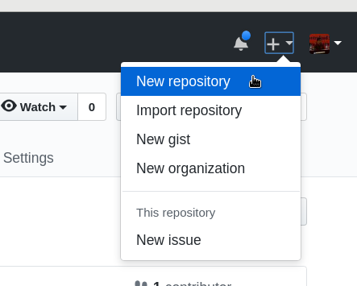

# Mengelola Repo Sendiri di Account Sendiri]

[ [<< Kembali](README.md) ]

Bagian ini merupakan seri tulisan tentang [Git](https://git-scm.com/). Silahkan ke [README.md](README.md) untuk memahami gambaran garis besar materi-materi yang dituliskan.

## Langkah-langkah

Setiap orang yang telah mempunyai account di GitHub bisa membuat repo dengan. Secara umum, langkah-langkahnya adalah sebagai berikut:

1. Buat repo kosong di GitHub, bisa *public* maupun *private*.
2. Cloe repo kosong tersebut di komputer lokal
3. Perintah berikutnya terkait dengan perubahan repo serta sinkronisasi antara GitHub dengan lokal.

## Membuat Repo

Untuk membuat repo, gunakan langkah-langkan berikut:

1.  Klik tanda **+** pada bagian atas setelah login, pilih **New repository**



2.  Isikan nama, keterangan, serta lisensi. Jika dikehendaki, bisa membuat repo **Private**


3. Klik ```Create Repository```

Setelah langkah-langkah tersebut, repo akan dibuat dan bisa diakses menggunakan pola ```https://github.com/username/reponame```. Pada repo tersebut, hanya akan muncul 1 file, yaitu LICENSE. Jika memilih membuat README pada saat langkah ke 2, juga akan muncul README.md. Ada atau tidak ada README.md tidak mempunyai efek apapun pada langkah ini.

## Clone Repo

Proses ```clone``` adalah proses untuk menduplikasikan remote repo di GitHub ke komputer lokal. Untuk melakukan proses ```clone```, gunakan perintah berikut:

``bash
git clone https://github.com/oldstager/awesome-project
Cloning into 'awesome-project'...
remote: Enumerating objects: 3, done.
remote: Counting objects: 100% (3/3), done.
remote: Compressing objects: 100% (2/2), done.
remote: Total 3 (delta 0), reused 0 (delta 0), pack-reused 0
Unpacking objects: 100% (3/3), done.
```

Setelah perintah ini, di direktori ```awesome-project``` akan disimpan isi repo yang sama dengan di GitHub. Perbedaannya, di komputer lokal terdapat direktori ```.git``` yang digunakan secara internal oleh Git.


