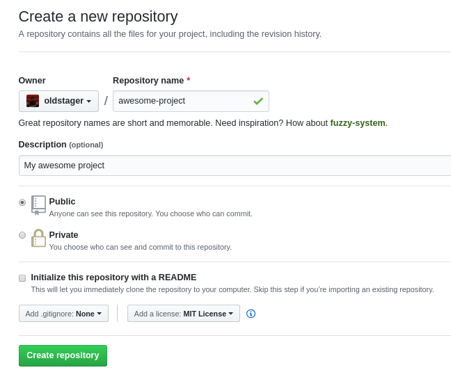
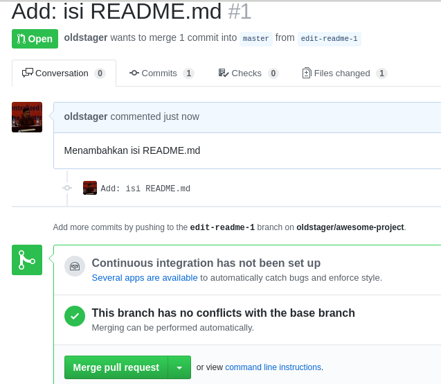

# Mengelola Repo Sendiri di Account Sendiri]

[ [<< Kembali](README.md) ]

Bagian ini merupakan seri tulisan tentang [Git](https://git-scm.com/). Silahkan ke [README.md](README.md) untuk memahami gambaran garis besar materi-materi yang dituliskan.

## Langkah-langkah

Setiap orang yang telah mempunyai account di GitHub bisa membuat repo dengan. Secara umum, langkah-langkahnya adalah sebagai berikut:

1. Buat repo kosong di GitHub, bisa *public* maupun *private*.
2. Cloe repo kosong tersebut di komputer lokal
3. Perintah berikutnya terkait dengan perubahan repo serta sinkronisasi antara GitHub dengan lokal.

## Membuat Repo

Untuk membuat repo, gunakan langkah-langkan berikut:

1.  Klik tanda **+** pada bagian atas setelah login, pilih **New repository**


2.  Isikan nama, keterangan, serta lisensi. Jika dikehendaki, bisa membuat repo **Private**



3. Klik ```Create Repository```

Setelah langkah-langkah tersebut, repo akan dibuat dan bisa diakses menggunakan pola ```https://github.com/username/reponame```. Pada repo tersebut, hanya akan muncul 1 file, yaitu LICENSE. Jika memilih membuat README pada saat langkah ke 2, juga akan muncul README.md. Ada atau tidak ada README.md tidak mempunyai efek apapun pada langkah ini.

## Clone Repo

Proses ```clone``` adalah proses untuk menduplikasikan remote repo di GitHub ke komputer lokal. Untuk melakukan proses ```clone```, gunakan perintah berikut:

```bash
git clone https://github.com/oldstager/awesome-project
Cloning into 'awesome-project'...
remote: Enumerating objects: 3, done.
remote: Counting objects: 100% (3/3), done.
remote: Compressing objects: 100% (2/2), done.
remote: Total 3 (delta 0), reused 0 (delta 0), pack-reused 0
Unpacking objects: 100% (3/3), done.
```

Setelah perintah ini, di direktori ```awesome-project``` akan disimpan isi repo yang sama dengan di GitHub. Perbedaannya, di komputer lokal terdapat direktori ```.git``` yang digunakan secara internal oleh Git.

## Mengelola Repo

Setelah ```clone``` ke komputer lokal, semua manipulasi konten dilakukan di komputer lokal dan hasilnya akan di-*push* ke remote repo di GitHub. Dengan demikian, jangan berganti-ganti remote lokal, sekali dibuat disitu, tetap berada disitu. Jika kehilangan repo lokal, clone ulang ke direktori yang bersih (kosong) setelah itu baru lakukan pengelolaan repo. Beberapa hal yang biasanya dilakukan akan diuraikan berikut ini.

### Mengubah Isi - Push Tanpa Branching dan Merging

Perubahan isi bisa terjadi karena satu atau kombinasi beberapa hal berikut:
1. File dihapus
2. File diedit
3. Membuat file / direktori baru
4. Menghapus direktori

Untuk kasus-kasus tersebut, lakukan perubahan di komputer lokal, setelah itu push ke repo. 

```bash
$ vim README.md
$ cat README.md
# My Awesome Project

$ git status
On branch master
Your branch is up to date with 'origin/master'.

Untracked files:
  (use "git add <file>..." to include in what will be committed)

	README.md

nothing added to commit but untracked files present (use "git add" to track)
$ git add -A
$ git commit -m "Add: README.md"
[master 2ab2e28] Add: README.md
 1 file changed, 2 insertions(+)
 create mode 100644 README.md
$ git push origin master
Username for 'https://github.com': oldstager
Password for 'https://oldstager@github.com': 
Enumerating objects: 4, done.
Counting objects: 100% (4/4), done.
Delta compression using up to 8 threads
Compressing objects: 100% (2/2), done.
Writing objects: 100% (3/3), 324 bytes | 324.00 KiB/s, done.
Total 3 (delta 0), reused 0 (delta 0)
To https://github.com/oldstager/awesome-project
   8dd68d4..2ab2e28  master -> master
$
```

Cara ini lebih mudah tetapi mempunyai resiko jika terjadi kesalahan dalam edit. Cara yang lebih aman tetapi memerlukan langkah yang lebih panjang adalah ```branching and merging```

### Mengubah Isi dengan Branching and Merging

Dengan menggunakan cara ini, setiap kali akan melakukan perubaham, perubahan itu dilakukan di komputer lokal dengan membuat suatu *cabang* yang nantinya digunakan untuk menampung perubahan-perubahan tersebut. Setelah itu, cabang itu yang akan dikirim ke repo GitHub untuk dimintai review kemudian digabungkan (```merge```) ke master. Secara umum, repo yang dibuat biasanya sudah mempunyai satu branch yang disebut dengan ```master```. Cara ini lebih aman, terstruktur, terkendali, dan mempunyai
history yang lebih baik. Jika perubahan yang kita buat sudah terlalu kacau dan kita menyesal, maka ada cara untuk "membersihkan" repo lokal kita. Secara umum, langkahnya adalah sebagai berikut:

1. Buat branch untuk menampung perubahan-perubahan
2. Lakukan perubahan-perubahan
3. Add dan commit perubahan-perubahan tersebut ke branch
4. Kembali ke repo master
5. Buat pull request di GitHub
6. Merge pull request di GitHub
7. Merge branch untuk menampung perubahan-perubahan tersebut ke master.
8. Selesai.

```bash
$ git checkout -b edit-readme-1
Switched to a new branch 'edit-readme-1'
$ vim README.md
$ cat README.md
# My Awesome Project

Ini isi proyek
$ git status
On branch edit-readme-1
Changes not staged for commit:
  (use "git add <file>..." to update what will be committed)
  (use "git checkout -- <file>..." to discard changes in working directory)

	modified:   README.md

no changes added to commit (use "git add" and/or "git commit -a")
$ git add -A
$ git commit -m "Add: isi README.md"
[edit-readme-1 032d079] Add: isi README.md
 1 file changed, 1 insertion(+)
$ git checkout master
Switched to branch 'master'
Your branch is up to date with 'origin/master'.
$ git status
On branch master
Your branch is up to date with 'origin/master'.

nothing to commit, working tree clean
$ git push origin edit-readme-1
Username for 'https://github.com': oldstager
Password for 'https://oldstager@github.com':
Enumerating objects: 5, done.
Counting objects: 100% (5/5), done.
Delta compression using up to 8 threads
Compressing objects: 100% (2/2), done.
Writing objects: 100% (3/3), 338 bytes | 338.00 KiB/s, done.
Total 3 (delta 0), reused 0 (delta 0)
remote:
remote: Create a pull request for 'edit-readme-1' on GitHub by visiting:
remote:      https://github.com/oldstager/awesome-project/pull/new/edit-readme-1
remote:
To https://github.com/oldstager/awesome-project
 * [new branch]      edit-readme-1 -> edit-readme-1
$

```

Setelah itu, kirim *pull request (PR)*:


Setelah membuat PR, PR tersebut bisa di-merge:



Setelah itu, ```Confirm Merge```, branch yang kita kirimkan tadi sudah dimasukkan ke branch ```master```. Setelah itu, merge di komputer lokal:

```bash
$ git merge edit-readme-1
Updating 2ab2e28..032d079
Fast-forward
 README.md | 1 +
 1 file changed, 1 insertion(+)
$ git branch -D edit-readme-1
Deleted branch edit-readme-1 (was 032d079).
$ git branch
* master
$
```


